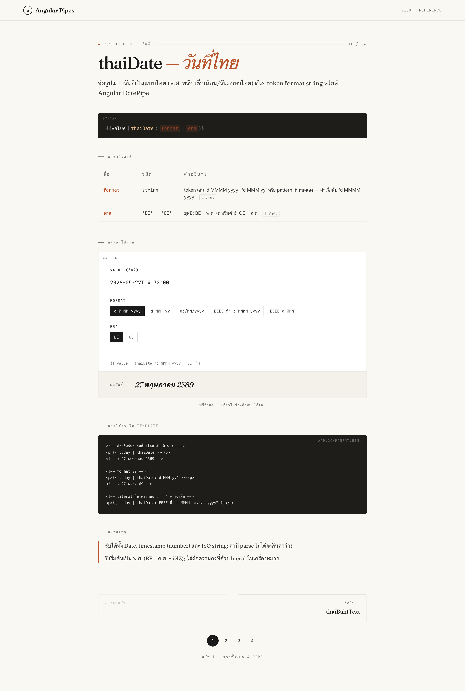

# Angular Custom Pipe Example

เว็บไซต์เอกสาร/ตัวอย่างการใช้งาน **Custom Pipes** ภาษาไทยของ Angular สร้างด้วย
**Angular 21** — ใช้ standalone components, signals และ control-flow block `@for`/`@if`
ผ่าน builder ตัวใหม่ `@angular/build` (esbuild/Vite) พร้อม Bootstrap 5 และ Bootstrap Icons

ภายในรวม custom pipe ที่ใช้งานจริง 4 ตัว ได้แก่ `thaiDate`, `thaiBahtText`,
`thaiIdCard` และ `thaiPhone` พร้อมหน้า docs ที่แสดง syntax, ตารางพารามิเตอร์,
ตัวอย่างโค้ด, หมายเหตุ และ **playground แบบโต้ตอบได้** ที่ลองพิมพ์/เลือกค่าแล้วเห็นผลลัพธ์สด

## ตัวอย่างหน้าจอ (Screenshot)



> 📸 **สำหรับ dev:** รูปด้านบนยังไม่มี — กรุณารันแอป (`npm start`) เปิดหน้าเว็บ
> แล้วแคปหน้าจอหน้า docs (เช่น pipe `thaiDate` พร้อม playground) บันทึกเป็น
> `docs/screenshots/pipe-docs.png` เพื่อให้รูปในไฟล์นี้แสดงผล

หน้า docs จะแสดงรายละเอียดของแต่ละ pipe — ทั้ง syntax, พารามิเตอร์, ตัวอย่างโค้ด,
playground ที่ลองค่าได้จริง และหมายเหตุการใช้งาน เลื่อนดูทีละ pipe ได้ผ่าน pager ด้านล่าง

---

## ความต้องการของระบบ (Requirements)

โปรเจคนี้รันบน **Node.js 24** และ **Angular 21**

| เครื่องมือ | เวอร์ชัน |
|-----------|---------|
| **Node.js** | `24` |
| **npm** | `>=8` (โปรเจคนี้ใช้ `npm@11.13.0`) |

---

## ขั้นตอนการติดตั้ง (Installation)

ติดตั้ง dependencies:
```bash
npm install
```

> ไม่จำเป็นต้องติดตั้ง Angular CLI แบบ global — โปรเจคนี้มี `@angular/cli`
> อยู่ใน devDependencies แล้ว เรียกใช้ผ่าน `npm run ...` ได้เลย

---

## ขั้นตอนการรันโปรเจค (Run)

### รันแบบ development (มี hot-reload)
```bash
npm start
```
แล้วเปิดเบราว์เซอร์ไปที่ **http://localhost:4200**
ทุกครั้งที่แก้ไฟล์ในโฟลเดอร์ `src/` หน้าเว็บจะ reload ให้อัตโนมัติ

---

## คำสั่งอื่น ๆ ที่ใช้บ่อย

| คำสั่ง | หน้าที่ |
|--------|---------|
| `npm start` | รัน dev server (`ng serve`) ที่ port 4200 |
| `npm run build` | build เวอร์ชัน production ออกไปที่โฟลเดอร์ `dist/` |
| `npm run watch` | build แบบ development พร้อม watch ไฟล์ |
| `npm test` | รัน unit test ด้วย **Vitest** |

---

## Custom Pipes ในโปรเจค

| Pipe | หน้าที่ |
|------|---------|
| `thaiDate` | จัดรูปแบบวันที่แบบไทย (พ.ศ. + เดือน/วันภาษาไทย) ด้วย token format string |
| `thaiBahtText` | อ่านจำนวนเงินเป็นตัวอักษรภาษาไทย (บาท/สตางค์/ถ้วน/ลบ) |
| `thaiIdCard` | จัดรูปแบบเลขบัตรประชาชน 13 หลัก พร้อม mask แบบ PDPA |
| `thaiPhone` | จัดรูปแบบเบอร์โทรไทย (มือถือ/บ้าน) พร้อม mask เสริม |

---

## โครงสร้างโปรเจคโดยย่อ

```
src/
├── app/                      # root component + app config
├── features/
│   └── pipe-docs/            # หน้าหลัก: เอกสาร custom pipes
│       ├── components/       # ส่วนประกอบย่อย (syntax-bar, params-table,
│       │                     #   pipe-playground, code-block, docs-pager, ฯลฯ)
│       ├── data-access/      # ข้อมูล pipe + logic จำลองของ playground
│       └── models/           # type / interface
├── shared/
│   └── pipes/                # custom pipe ภาษาไทย 4 ตัว (+ unit test)
├── styles.scss               # global design tokens + styles
├── fonts.scss                # self-hosted fonts
└── main.ts                   # จุดเริ่มต้นของแอป
```

> **หมายเหตุ:** playground ในหน้า docs ใช้ logic จำลอง (`data-access/playground-sim.ts`)
> ที่เขียนแยกจาก pipe จริงใน `shared/pipes/` โดยตั้งใจ — มี `playground-sim.spec.ts`
> ยืนยันว่าผลลัพธ์ตรงกับ pipe จริงเพื่อกันการ drift
